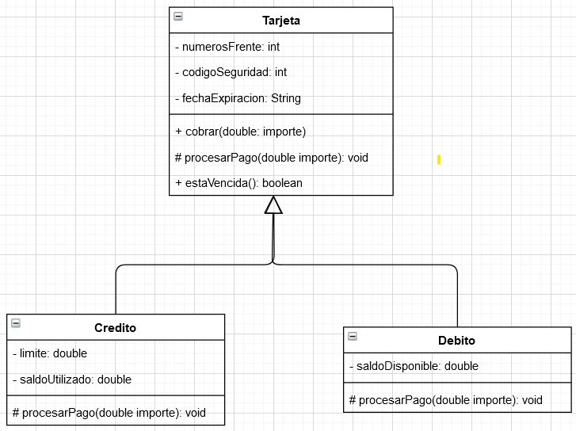

# Ejercicio
Pensemos en un sistema para validar pagos, ya sea por tarjeta de crédito o de débito. Una tarjeta está compuesta por los números del frente, un código de seguridad y una fecha de expiración. A su vez, la tarjeta puede ser de crédito o de débito. Si es de crédito, tendrá un campo para el límite y otro para el saldo utilizado. Si es de débito, tendrá un único campo para el saldo disponible.

Para realizar un pago con tarjeta, es necesario recibir una autorización. Si la tarjeta es de débito, la autorización se produce si el saldo de la cuenta sobre la que se debita la tarjeta es suficiente. En el caso de crédito, se produce si el límite no ha sido superado. Actualmente, contamos con dos servicios llamados: ProcesadorCredito y ProcesadorDebito. Ambos cuentan con un método para procesar el pago, pero antes, validamos que la fecha de expiración sea posterior a la fecha actual. Esa lógica es común, independientemente si el pago se está realizando con débito o crédito, es decir, tenemos un código que se repite en los dos métodos. Los métodos que utilizan los dos procesadores de pago reciben la tarjeta y el monto a cobrar.

Nos gustaría eliminar el código repetido. ¿Cómo lo resolverías aplicando el patrón template method? También nos gustaría poder ver por consola si el pago pudo ser autorizado. Te proponemos realizar el diagrama UML e implementación en JAVA.

# UML
