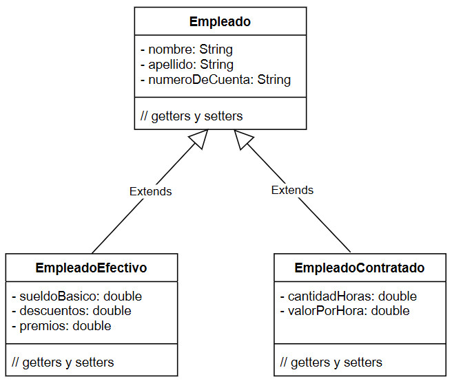
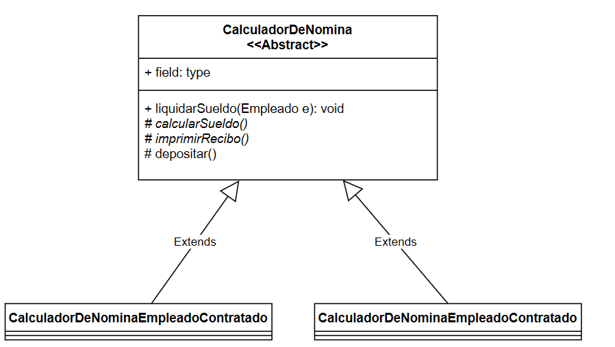

# Ejercicio
Para realizar la liquidación de sueldos es necesario realizar tres pasos. Calcular el sueldo
correspondiente, imprimir o generar recibos de sueldo y depositar el importe
correspondiente.
Hay distintos tipos de empleados. En el caso de los empleados efectivos o en “relación de
dependencia”, el cálculo es a partir de un sueldo básico y se agregan descuentos y
premios. Los empleados contratados trabajan una cantidad de horas, cada una con cierto valor. Con esta información se realiza el cálculo del sueldo a pagar y luego se imprime, por
último se deposita.

El proceso que realizamos es liquidacionSueldo. Este lleva tres pasos: cálculo, impresión y
depósito. En cuanto al cálculo, este se realiza según el tipo de empleado. La impresión
puede ser digital, en el caso de los contratados, o en un recibo en papel en el caso de los
efectivos, y por último el depósito es una cuenta bancaria.
Los empleados efectivos tienen como información, sueldo básico y un valor fijo de
descuentos y otro de premios. Los empleados contratados tienen cantidad de horas
trabajadas y valor hora. Ambos deben tener nombre, apellido y un número de cuenta
donde se deposita el sueldo.
Para simplificar vamos a emitir un mensaje en la parte de imprimir el recibo que informe si
es un documento digital o un recibo impreso.

# UML

