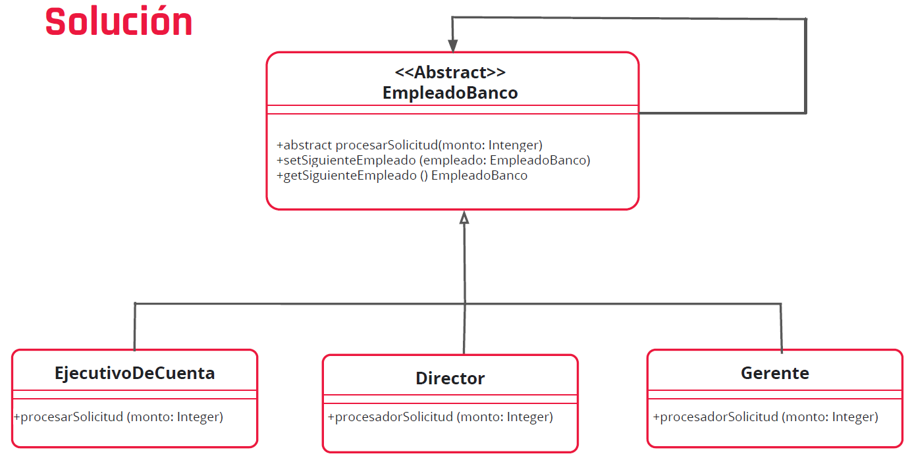

# Ejercicio
Imaginemos que estamos desarrollando un sistema para el área de créditos en un banco y queremos que al momento de que un cliente solicite un crédito se envíe un pedido a los diferentes encargados de autorizarlo. El banco nos indicó que:

- Si el monto no supera los 60.000, entonces, el ejecutivo de cuenta puede
  aprobarlo.
- Si el monto está entre los 60.000 y 200.000, entonces, el gerente es quien
  lo aprueba.
- Si el monto se encuentra por encima de 200.000 lo aprueba el director.

# UML
