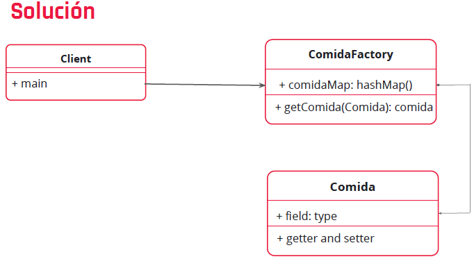

# Ejercicio
Supongamos que tenemos un recetario que contiene recetas que están
en diferentes colecciones como carne; sopas; ensaladas; o en diferentes
categorías como comida italiana; mexicana; argentina; rápidas.

La receta para una hamburguesa podría estar en varias
secciones: americana, carnes, rapidas, etc. Si necesitáramos
tener un objeto receta hamburguesa en cada una de las
colecciones sería muy poco performante y se usaría mucha
memoria.

Entonces, el cliente pide un objeto a la FlyweightFactory, esta se
fija si existe en el caché y en caso contrario crea uno nuevo.
Flyweight comparte el estado de los objetos.

# UML
