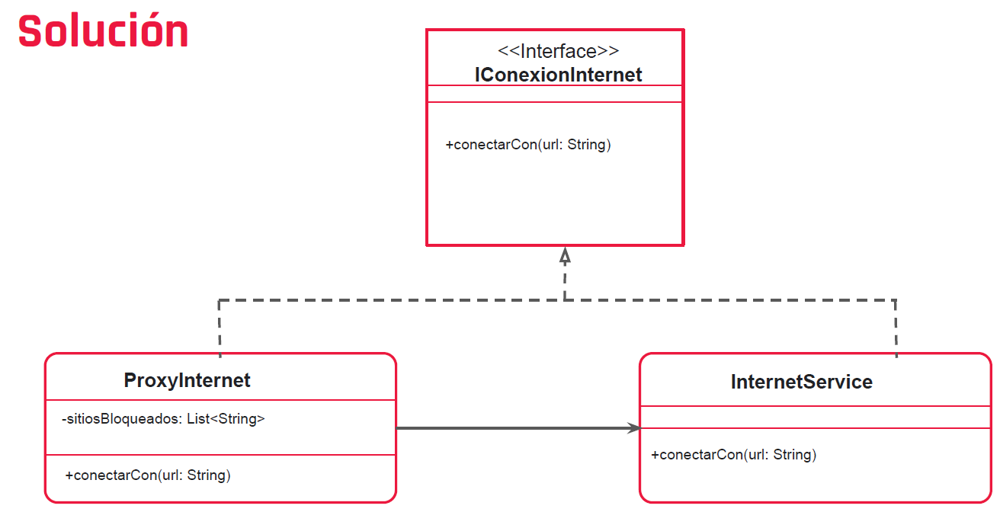

# Ejemplo
Pensemos en un escenario de la vida real, en algunos lugares, como la
universidad o el trabajo, la red que nos conecta a Internet está
limitada y no tenemos acceso a todos los sitios.

Puede ser que tengamos un proxy que esté restringiendo el acceso y
en lugar de conectarnos directamente a Internet, estemos
comunicándonos con el proxy y sea este el que finalmente se
comunica con Internet.
# UML
