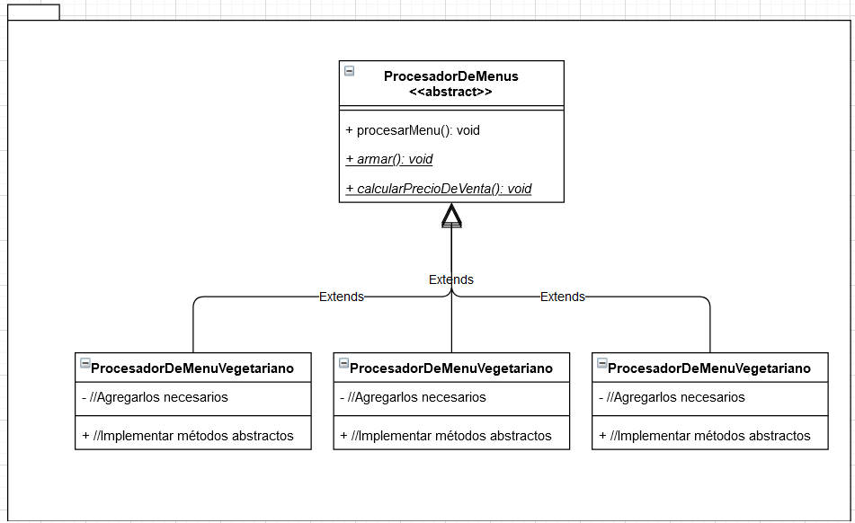
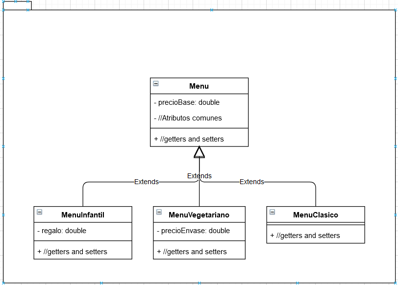

# Ejercicio
En un negocio de venta de comidas rápidas que solo vende menús armados para llevar,
tienen clasificados los productos como menú adulto, menú infantil o menú vegetariano.

Todos los menús tienen un precio base, es decir, se puede incrementar si lleva agregados.
Cuando un cliente adquiere los productos, los empleados deben armar el paquete de cada
menú y luego calcular su costo. El proceso de preparar un menú implica armado y luego
su cálculo del precio de venta.

Los menús adulto solo llevan lo que dice en su oferta y no se incrementa su valor. Los
menús infantiles tienen un regalo sorpresa, que se debe agregar y que tiene un costo
adicional.

Los menús vegetarianos tienen un packaging especial ya que se le agregan condimentos. El
costo se incrementa con el valor del envase y un recargo de 1% por condimentos.

Necesitamos un sistema que muestre un mensaje a los empleados con los elementos
adicionales, si corresponde, para que no olviden hacerlo en el momento del armado.
Luego, deberá informar el costo del menú vendido.

Tanto el armado como el cálculo del costo son procesos que siempre se hacen con todos
los productos vendidos.

# UML

