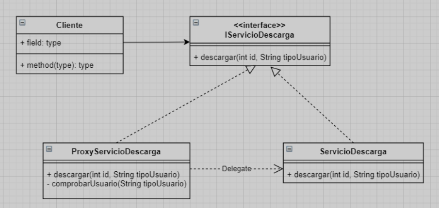

# Ejercicio
En el servicio de Spotify pago permite descargar canciones para escuchar offline. Cuando
un usuario solicita descargar una canción, el servicio de Spotify comprueba si es un usuario
premium para darle acceso a esta funcionalidad. Los usuarios tienen un identificador y una
string con el tipo de usuario (“Free”,”Premium”).

Implementar una clase servicioDescarga que permita descargar una canción y mediante
el patrón proxy comprobar si es posible hacerlo.

# UML
