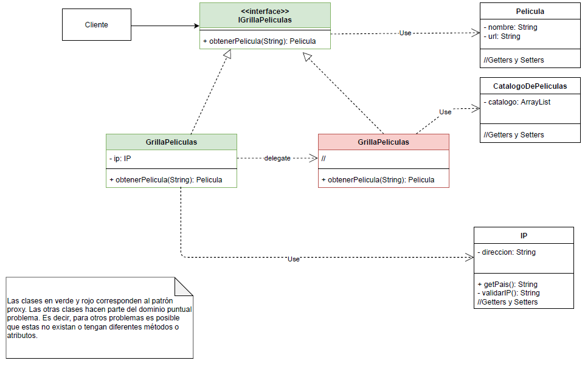

# Ejercicio
Estamos desarrollando una aplicación de streaming, al estilo Netflix, con el objetivo de que
la usen usuarios de todo el mundo. Por el momento, solo estamos recibiendo películas
para Argentina, Brasil y Colombia. En este caso, necesitamos desarrollar una
funcionalidad en particular:

Como cliente, queremos que la aplicación nos permita hacer un pedido con el nombre de
la película y nos envíe el objeto película que posee el enlace de reproducción. Las
diferentes películas están habilitadas en solo uno de los países y nos permiten verla si
estamos en el país correspondiente.

Para poder saber en qué país se encuentra el cliente, se nos ocurrió utilizar la dirección IP
de la solicitud que nos envía. Dado que las direcciones IP tienen un formato definido por 4 números (del 0 al 255) separados por puntos, quedando como: 255.255.255.255, podemos
tomar el primer número de la dirección para saber de qué país proviene:

- 0 a 49 -> Argentina
- 50 a 99 -> Brasil
- 100 a 149 -> Colombia

# Se propone crear

- Una Interface IGrillaDePeliculas que define un método getPelicula que recibe el
nombre, devolviendo un objeto película.
- Una clase GrillaDePeliculas que implementa la interface IPelícula y devuelve una
película.
- Una clase GrillaDePeliculasProxy que posee un atributo IP y le pide a GrillaDePeliculas una película —con getPelicula y la “filtra” según el país, recordar  cómo se encuentra el país desde la IP—, si no es posible enviarla a ese país, lanza
una excepción del tipo PeliculaNoHabilitadaException creada a tal fin.
  
# Se utilizarán las clases:
- Película que posee un nombre, un país y un link de reproducción —todos
String—.
- IP que posee cuatro enteros (números de 0 a 255).

En el método main, realizar pedidos de películas con el nombre y la IP haciéndolo con
ejemplos de los 3 países. Mostrar el link de la película si está habilitada, sino un cartel de
“Película no disponible en su país”.
# UML
