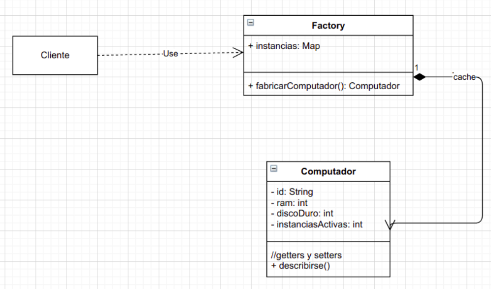

# Ejercicio
Un negocio necesita generar computadoras con distintas especificaciones, así como
también reutilizar las mismas especificaciones. Los tipos de computadoras que hay son :
* Windows
    * RAM: 2
    * Disco duro: 128
* Mac
    * RAM: 16
    * Disco duro: 500

Es necesario que la aplicación no genere altos costos en en los recursos: tiene que estar
optimizada. Las computadoras tendrán los siguiente atributos:
* Ram
* Memoria
* Id
* Contador(servirá para almacenar el número de instancias)

ComputadoraFactory va ser el contenedor de computadoras que almacenará los
diferentes tipos. Se necesitará aplicar si el la computadora existe obtenerla sino generarla.
Necesitamos que nos informe las computadoras creadas.

# UML
